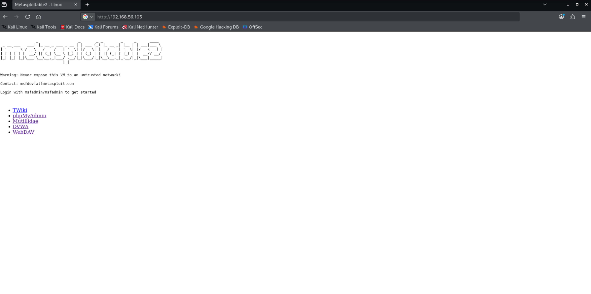
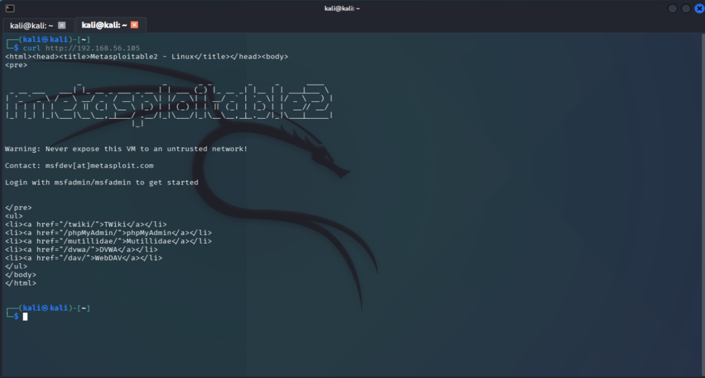
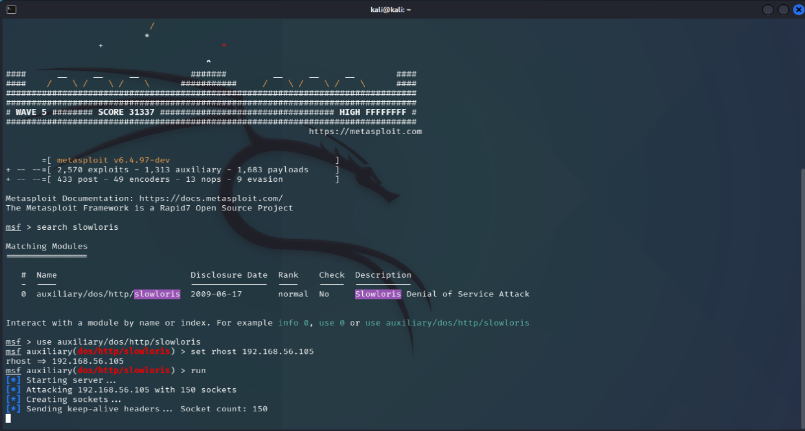
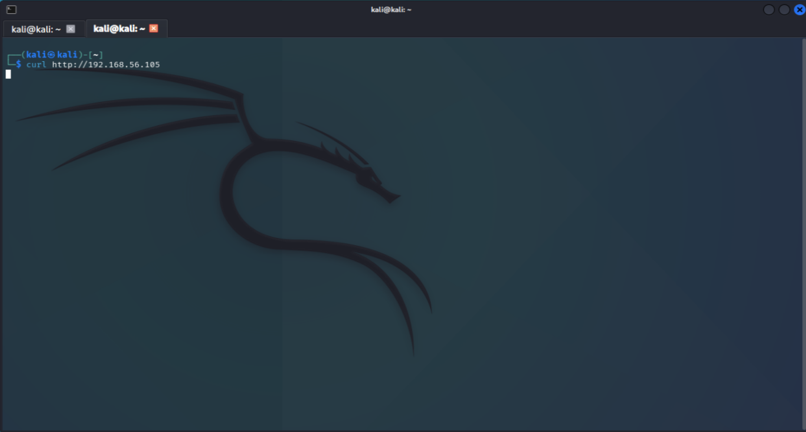
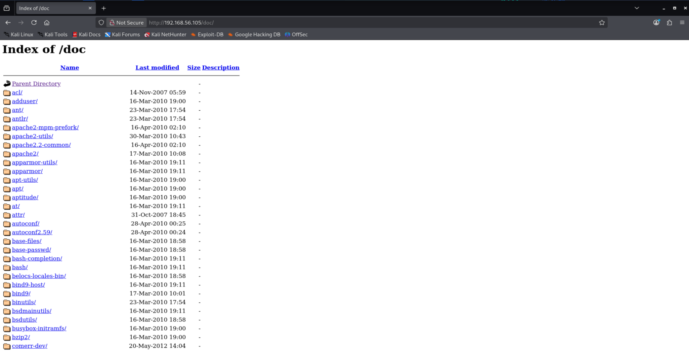
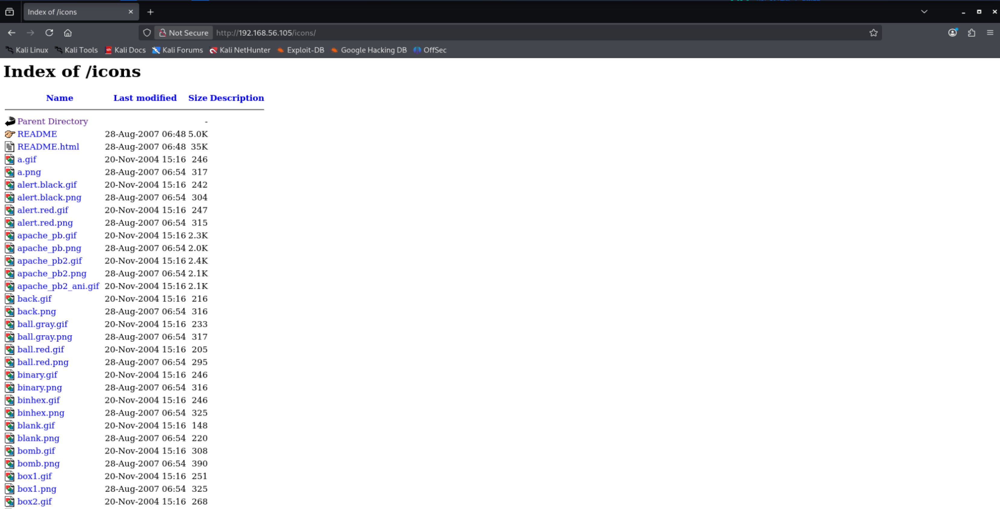
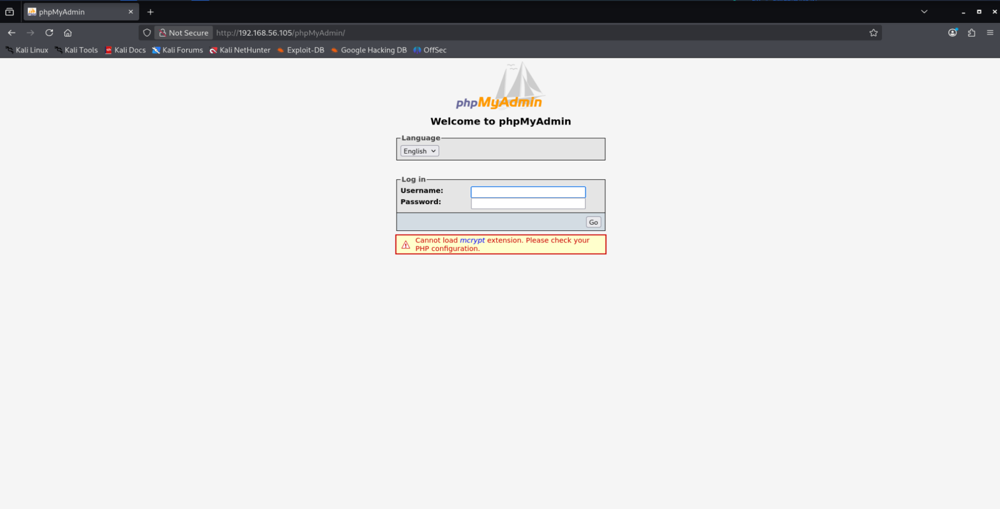
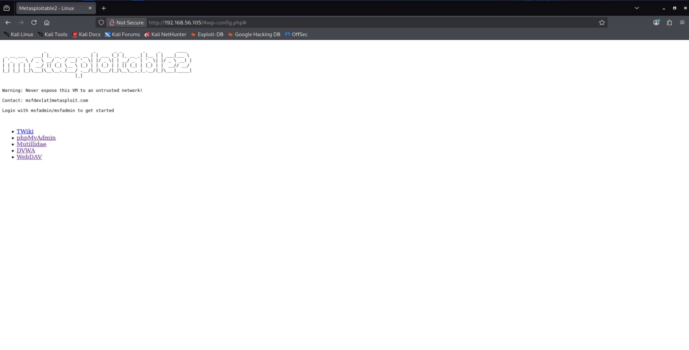
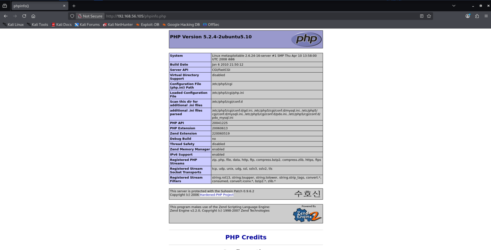

# FTP Service (Port 21)

## Vulnerabilità confermate

### 1. vstfpd 2.3.4 Backdoor (CVE-2011-2523)
Severity: Critical
Tool: Nmap, OpenVAS
Description: versione di vsftpd nota con backdoor che permette l'apertura di una shell remota
CVEs:
- CVE-2011-2523
- CVE-2011-2523
Check: confermata manualmente

### 2. Anonymous login enable
Severity: High
Tool: Nuclei
Description: Possibilità di acceso anonimo ad FTP con username="anonymous" e password="somepass"
Check: `ftp IP_TARGET` and `username=anonymous; password=SOME_PASSWORD`

### Vulnerabilità escluse
- DoS vsftpd 3.0.3: versione non corrispondente
- CVE-2021-1419: vulnerabilità SSH non FTP

### 3. Weak/Know login credentials
Severity: Medium
Tool: OpenVAS
Description: Possibilità di accesso ad FTP con credenziali deboli o note (msfadmin:masfadmin)
Check: `ftp msfadmin@IP_TARGET` and `passoword=msfadmin`

# SSH Service (Port 22)

## Vulnerabilità confermate

### 1. Outdated and weak SSH cryptographic configuration
Severity: Medium
Tool: Nuclei, OpenVAS
Description: il server supporta algoritmi di cifratura e MAC obsoleti come `diffie-hellman-group1-sha1`, `hmac-sha1`, `cbc-mode` 
Check: `nmap --script ssh2-enum-algos -p22 192.168.56.105`

### 2. Weak Authentication Configuration
Severity: Low/Medium
Tool: Nuclei
Description: Il server SSH accetta autenticazione via password, potenzialmente soggetto a brute-force
Check: testare credenziali comuni o default

### Informational
- SSH Version Disclosure  
- SSH Auth Methods Enumeration

# Telnet Service (Port 23)

## Vulnerabilità confermate

### 1. Telnet Service Enabled
Severity: High
Tool: OpenVAS, Nmap
Description: Il servizio Telnet trasmette credenziali in chiaro, consentendo attacchi di sniffing e MITM. Inoltre è un protocollo deprecato considerato intrinsecamente insicuro
Check: Manual
- Avio telnet e login
- Sniffing via Wiresharl (tcp.port == 23)

Impact: Compromissione totale delle credenziali in rete locale

### 2. Weak/Default Credentials Allowed via Telnet
Severity: High
Tool: manual test
Check: Login with default / known password `msfadmin:msfadmin`
Impact: Accesso remoto completo con bruteforce

# SMTP Service (Port 25)

## Vulnerabilità confermate

### 1. SATRTTLS Plaintext Command Injection
Severity: Medium
Tool: OpenVAS
Description: L'implementazione STARTTLS è vulnerabile a injection di comandi
CVEs: 
- CVE-2011-0411
- CVE-2011-1430
- CVE-2011-1431
- CVE-2011-1432
- CVE-2011-1506
- CVE-2011-1575
- CVE-2011-1926
- CVE-2011-2165 

### 2. SMTP User Enumeration via VRFY/EXPN
Severity: Medium
Tool: OpenVAS
Description: L'attaccante può enumerare account locali del sistema
Impact: Facilita brute-force e attacchi mirati
Check: 

|[msframework enum on smtp service](img/msframework_enum_smtp.png)

### 3. Weak / Insecure TLS Configuration
Severity: Medium
Tool: OpenVAS; Nmap
Description: Il servizio SMTP accetta molte configurazioni TLS insicure:
- SSLv2/SSLv3 attivi (POODLE)
- RSA key < 2048 bit
- DH group insufficiente, DH anonimo
- FREAK (RSA_EXPORT)
- TLSv1.0 / TLSv1.1
- Certificato debole o scaduto
- Vulnerabilità Logjam (CVE-2015-4000)
Impact: possibili attacchi MITM e downgrade

# DNS service (Port 53)

## Vulnerabilità confermate
Nessuna vulnerabilità è stat rilevata da OpenVAS, Nmap o Nuclei sulla porta 53/tcp.
Nessuno degli strumenti ha riportato CVE, misconfigurazioni o problemi di sicurezza relativi al servizio DNS.

# HTTP service (port 80)

## Vulnerabilità confermate

### 1. Outdated Apache/PHP
Severity: High
Tool: Nikto, OpenVAS
Description: Il server utilizza Apache/2.2.8 e PHP/5.2.4, entrambe versioni fuori supporto e affette da numerose vulnerabilità note, incluse esecuzione di codice remoto, buffer overflow, memory corruption e DoS.
Impact: Un attaccante può sfruttare una delle molte CVE note per ottenere l’esecuzione di codice remoto o compromettere la disponibilità e l’integrità del server.
CVEs:
- CVE-2012-1823
- CVE-2012-2311
- CVE-2012-2336
- CVE-2012-2335
Check: `curl -I http:192.168.56.105`

### 2. Slowloris DoS
Severity: High
Tool: Nmap (`http-slowloris-check`)
Description: Il server risulta vulnerabile all’attacco Slowloris, che mantiene aperte connessioni HTTP incomplete al fine di esaurire i thread del server.
Impact: Un attaccante può rendere il sito completamente irraggiungibile saturando le connessioni HTTP, causando DoS.
Check: confermata tramite l'uso del modulo `auxiliar/dos/http/slowloris` di MetasploitFramework:

### 3. Directory Indexing & Sensitive File Exposure
Severity: Medium
Tool: Nikto, Nmap, OpenVAS
Description: Diversi percorsi del server presentano directory listing o file sensibili accessibili, tra cui /doc/, /icons/, /phpMyAdmin/, /test/ e #wp-config.php#.
Impact: Consente enumeration di file, leakage di informazioni sensibili, e in alcuni casi accesso a credenziali.
CVEs:
- CVE-1999-0678
- CVE-2003-1418
- CVE-1999-0678
See also:
- http://www.wisec.it/sectou.php?id=4698ebdc59d15,https://exchange.xforce.ibmcloud.com/vulnerabilities/8275
- https://www.vntweb.co.uk/apache-restricting-access-to-iconsreadme/
- https://typo3.org/
Check: manuale

### 4. PHP Information Disclosure
Severity: Medium
Tool: Nikto, Nmap, OpenVAS
Description: La presenza della pagina phpinfo.php permette di visualizzare dettagli sensibili sulla configurazione PHP.
Impact: Espone informazioni critiche come path di sistema, moduli caricati, variabili, versioni e configurazioni utili a un attaccante.
CVEs:
- CWE-552
- CVE-2008-0149
- CVE-2023-49282
- CVE-2023-49283
- CVE-2024-10486
Check: manuale

### 5. PHP Easter Eggs Information Disclosure
Severity: Medium
Tool: Nikto
Description: PHP risponde con contenuti speciali (“Easter Eggs”) quando vengono utilizzate particolari query string.
Impact: Queste risposte rivelano informazioni su build, moduli, configurazioni interne, potenzialmente utili a enumerazione del server.
Evidence: check the file `/scans/web/nikto/T01_nikto.txt`

### 6. Dangerous HTTP Methods Enabled (TRACE/PUD/DELETE)
Severity: Medium
Tool: Nikto, Nmap, OpenVAS
Description: Il server accetta HTTP TRACE e altri metodi pericolosi, inclusi PUT/DELETE in certe configurazioni.
Impact: Possibile attacco XST (Cross-Site Tracing), upload/cancellazione file , ampliamento della superficie di attacco
CVEs:
- CVE-2003-1567
- CVE-2004-2320
- CVE-2004-2763
- CVE-2005-3398
- CVE-2006-4683
- CVE-2007-3008
- CVE-2008-7253
- CVE-2009-2823
- CVE-2010-0386
- CVE-2012-2223
- CVE-2014-7883
See also:
- See: https://owasp.org/www-community/attacks/Cross_Site_Tracing

### 7. CSRF Vulnerabilities in Web Application
Severity: Medium
Tool: Nmap, OpenVAS
Description: Diverse pagine di DVWA, Mutillidae e TWiki non implementano protezioni anti-CSRF.
Impact: Un attaccante può far eseguire azioni allo user autenticato tramite link o pagine malevoli.
CVEs:
- CVE-2009-4898
- CVE-2009-1339

### 8. Multiple XSS Vulnerabilities
Severity: Medium
Tool: OpenVAS
Description: Diverse applicazioni ospitate (TWiki, phpMyAdmin, jQuery vecchie versioni) sono affette da vulnerabilità XSS.
Impact: Possibile esecuzione arbitraria di JavaScript con furto sessioni, escalation applicativa e phishing.
CVEs:
- CVE-2008-5304
- CVE-2012-6708
- CVE-2010-4480

### 9. Local File Inclusion (LFI)
Severity: Medium
Tool: OpenVAS
Description: Le applicazioni QWiki e awiki permettono l’inclusione di file locali attraverso validazione insufficiente dei parametri.
Impact: L’attaccante può leggere file arbitrari sul server (/etc/passwd, config vari).
CVE:
- CVE-2005-0283

### 10. Sensitive Information Transmitted in Cleartex
Severity: Medium
Tool: OpenVAS
Description: Credenziali e dati sensibili vengono trasmessi tramite HTTP non cifrato.
Impact: Sniffing in rete locale con possibile compromissione account

### 11. Apache HttpOnly Cookie Misconfiguration
Severity: Medium
Tool: OpenVAS
Description: Apache non applica correttamente l’attributo HttpOnly nei cookie, permettendo la lettura via JavaScript.
Impact: In presenza di XSS, un attaccante può rubare sessioni.
CVE:
- CVE-2012-0053

### 12. Missing Standard Security Headers
Severity: Medium/Low
Tool: Nikto, Nuclei
Description: Mancano header di sicurezza standard (X-Frame-Options, CSP, HSTS, ecc.).
Impact: Non causano vulnerabilità dirette, ma permettono attacchi come clickjacking, downgrade HTTPS, trasformazioni MIME e leakage referer.

