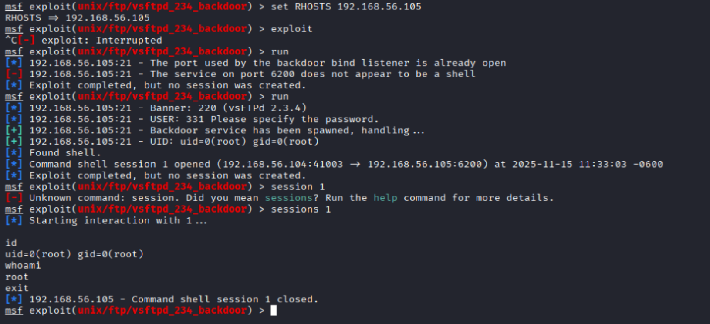
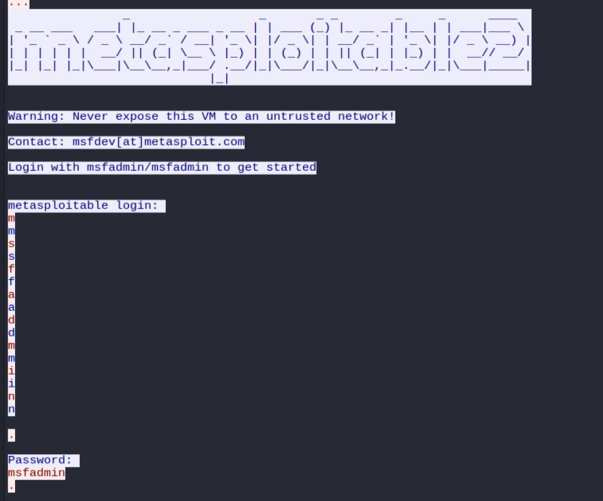
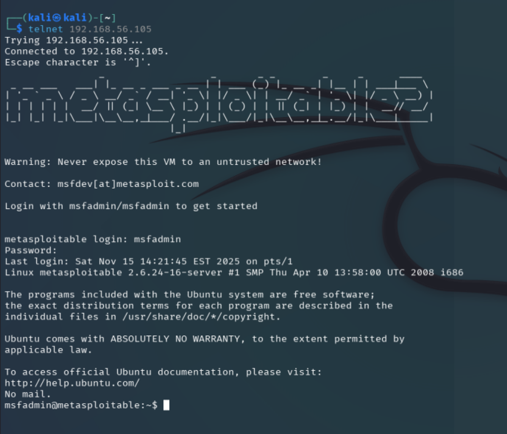
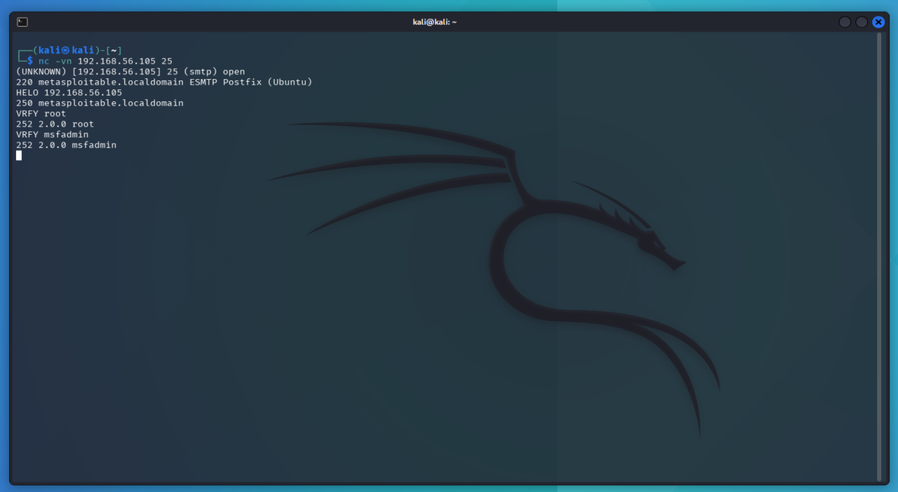

# FTP Service (Port 21)

## Vulnerabilità confermate

### 1. vstfpd 2.3.4 Backdoor (CVE-2011-2523)
Severity: Critical
Tool: Nmap, OpenVAS
Description: versione di vsftpd nota con backdoor che permette l'apertura di una shell remota
Evidence:
- Nmap: rilevata versione (2.3.4) con backdoor - CVE-2011-2523
- OpenVAS: Conferma CVE-2011-2523
Check: confermata manualmente

### 2. Anonymous login enable
Severity: High
Tool: Nuclei
Description: Possibilità di acceso anonimo ad FTP con username="anonymous" e password="somepass"
Check: `ftp IP_TARGET` and `username=anonymous; password=SOME_PASSWORD`

### Vulnerabilità escluse
- DoS vsftpd 3.0.3: versione non corrispondente
- CVE-2021-1419: vulnerabilità SSH non FTP

### 3. Weak/Know login credentials
Severity: Medium
Tool: OpenVAS
Description: Possibilità di accesso ad FTP con credenziali deboli o note (msfadmin:masfadmin)
Check: `ftp msfadmin@IP_TARGET` and `passoword=msfadmin`

# SSH Service (Port 22)

## Vulnerabilità confermate

### 1. Outdated and weak SSH cryptographic configuration
Severity: Medium
Tool: Nuclei, OpenVAS
Description: il server supporta algoritmi di cifratura e MAC obsoleti come `diffie-hellman-group1-sha1`, `hmac-sha1`, `cbc-mode` 
Check: `nmap --script ssh2-enum-algos -p22 192.168.56.105`

### 2. Weak Authentication Configuration
Severity: Low/Medium
Tool: Nuclei
Description: Il server SSH accetta autenticazione via password, potenzialmente soggetto a brute-force
Check: testare credenziali comuni o default

### Informational
- SSH Version Disclosure  
- SSH Auth Methods Enumeration

# Telnet Service (Port 23)

## Vulnerabilità confermate

### 1. Telnet Service Enabled
Severity: High
Tool: OpenVAS, Nmap
Description: Il servizio Telnet trasmette credenziali in chiaro, consentendo attacchi di sniffing e MITM. Inoltre è un protocollo deprecato considerato intrinsecamente insicuro
Check: Manual
- Avio telnet e login
- Sniffing via Wiresharl (tcp.port == 23)

Impatto: Compromissione totale delle credenziali in rete locale

### 2. Weak/Default Credentials Allowed via Telnet
Severity: High
Tool: manual test
Check: Login with default / known password `msfadmin:msfadmin`
Impatto: Accesso remoto completo con bruteforce

# SMTP Service (Port 25)

## Vulnerabilità confermate

### 1. SATRTTLS Plaintext Command Injection
Severity: Medium
Tool: OpenVAS
Description: L'implementazione STARTTLS è vulnerabile a injection di comandi
Evidence: CVE-2011-0411, CVE-2011-1430, CVE-2011-1431, CVE-2011-1432, CVE-2011-1506, CVE-2011-1575, CVE-2011-1926, CVE-2011-2165 

### 2. SMTP User Enumeration via VRFY/EXPN
Severity: Medium
Tool: OpenVAS
Description: L'attaccante può enumerare account locali del sistema
Impatto: Facilita brute-force e attacchi mirati
Check: 

|[msframework enum on smtp service](img/msframework_enum_smtp.png)

### 3. Weak / Insecure TLS Configuration
Severity: Medium
Tool: OpenVAS; Nmap
Description: Il servizio SMTP accetta molte configurazioni TLS insicure:
- SSLv2/SSLv3 attivi (POODLE)
- RSA key < 2048 bit
- DH group insufficiente, DH anonimo
- FREAK (RSA_EXPORT)
- TLSv1.0 / TLSv1.1
- Certificato debole o scaduto
- Vulnerabilità Logjam (CVE-2015-4000)
Impatto: possibili attacchi MITM e downgrade